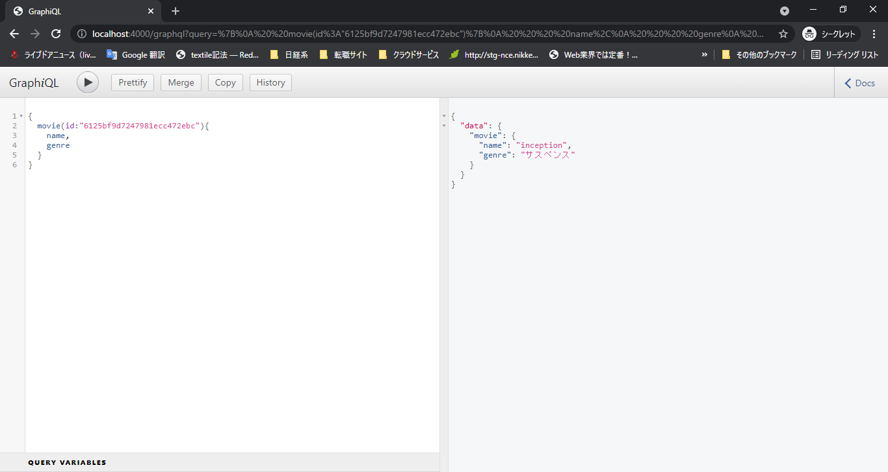
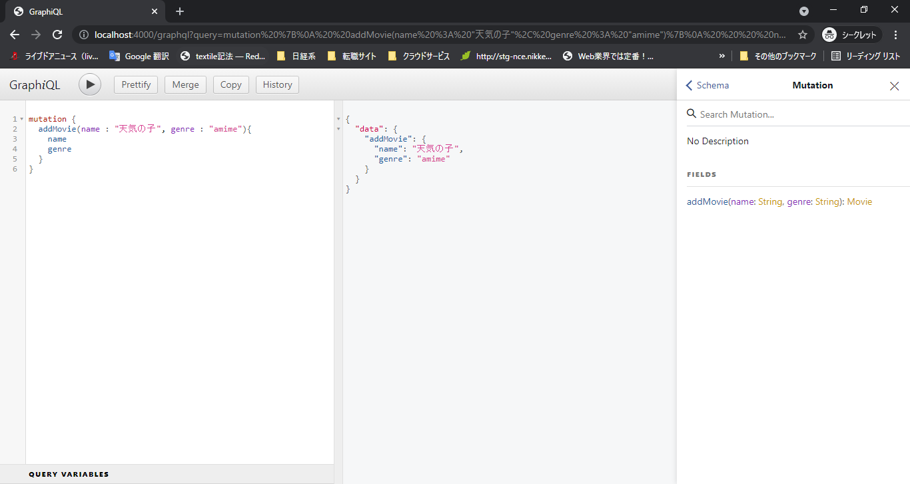
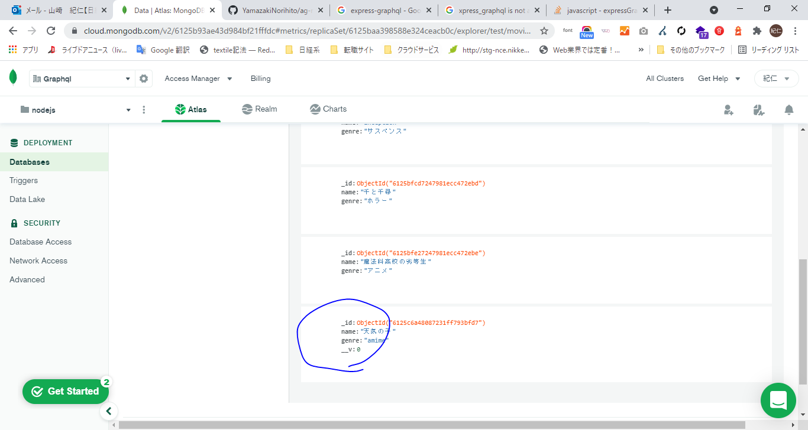
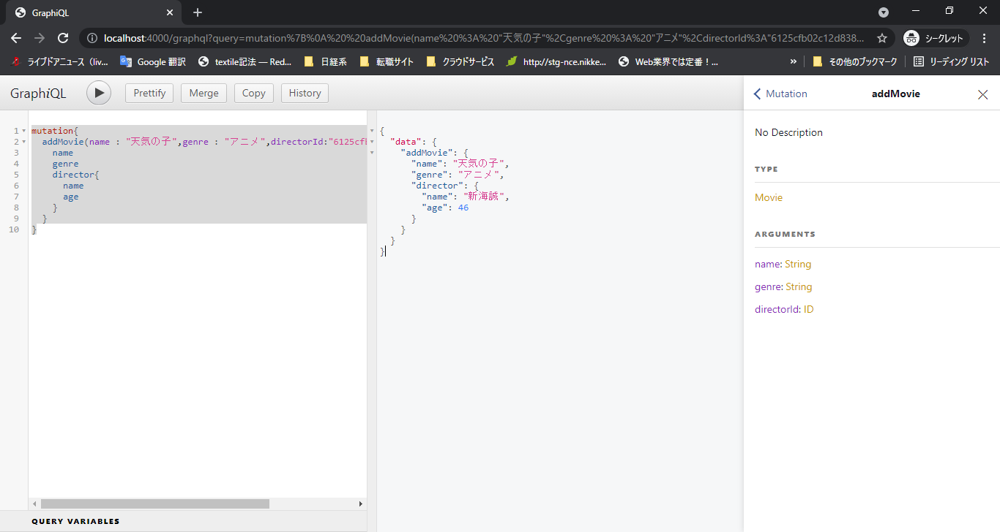
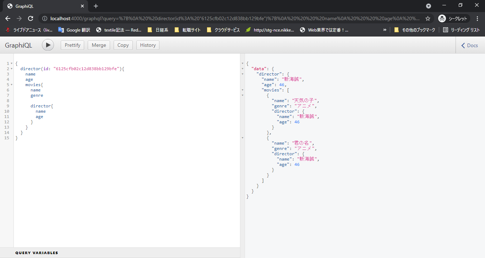

### info

os:windows 10 pro


#### npm 

- version
```bash
$ npm -v
6.14.13
```

#### create project

```bash

$mkdir server

$cd server

$npm init

```

#### install

- express
```bash
$ npm install express
```
- nodemon

```bash
$ npm install nodemon
```
- grahQL

```bash
$npm install graphql express-graphql
$npm install graphql express-graphql -save
```

- mongoose

```bash
$ npm install mongoose
```

#### server start

```bash
$ npx nodemon app.js
```

#### mongodb

##### set up
https://www.mongodb.com/cloud/atlas/lp/try2

1. create/organizations
1. create/projects
1. Build a Database
1. Crate DB
   1. Free Shared DB
      1. provider : aws
      1. region:east-1
1. Db USer add
   1. user : admin
   1. pw : ****
   1. Auth : Read  & write
1. Add IP Access List Entry
   好きなのを選択 
   1. Add Current IP Address : my ip
   1. Allow Access from Anywhere : all ip
   1. white list ip
1. Connect
   1. connect your applicatin 
1. Create Collection
   1. db
      1. name : test
         1. collection name :movies

#### graphql

*ui*
http://localhost:4000/graphql

##### get graphQL


##### insert graphQL



##### releation insert graphQL



